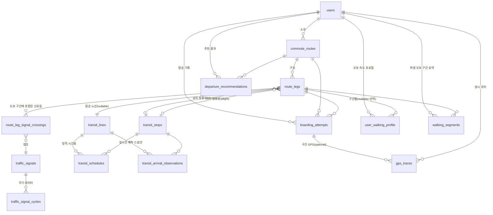

# 데이터 모델

전체 DDL은 [db/schema.sql](./db/schema.sql) 참고. 여기서는 엔티티별 의도와 관계를 설명한다.

## ER 다이어그램

## 엔티티 설명

### `users`
사용자. 개인 프로젝트라도 앱/데스크탑/백엔드가 분리되어 있어 인증 주체가 필요하므로 처음부터
둔다.

### `commute_routes`
사용자가 등록한 "출퇴근 루틴" 단위. 예: "평일 출근 - 집→광역버스 M4403→GTX→회사".
`direction`으로 출근/퇴근을 구분한다. 같은 목적지라도 시간대별로 다른 루트를 쓸 수 있으므로
사용자당 여러 개 가질 수 있다.

### `route_legs`
`commute_route`를 구성하는 개별 구간을 순서(`seq_order`)대로 나열한 것.
`leg_type`이 `WALK`이면 도보 구간(도보 거리/좌표), `BUS`/`SUBWAY`/`GTX`면 탑승 구간
(`transit_line_id`, 승차/하차 정류장)이다. 이렇게 나눈 이유는 "최종 목적지 도착 시각"을
맞추려면 각 구간의 시간을 역산해서 더해야 하기 때문이다 (도보 → 탑승 → 도보 → 탑승 → 도보).

### `transit_lines` / `transit_stops`
버스 노선/지하철·GTX 노선, 정류장/역의 마스터 데이터. 외부 공공데이터 API의 ID를
`external_id`에 그대로 보관해서 동기화 잡이 upsert하기 쉽게 한다.

### `transit_schedules`
정적 시간표. 실시간 API가 없는 노선(예: GTX 일부, 막차 시간대)의 fallback이자, 실시간
예측이 튈 때 비교 기준이 된다.

### `transit_arrival_observations`
외부 API가 특정 시점에 준 "예상 도착 시각"을 그대로 스냅샷으로 남긴다. 나중에
`boarding_attempts.vehicle_actual_departure_at`과 비교해서 "이 노선/시간대는 API가
평균 90초 늦게 예측한다" 같은 보정치를 계산하는 원재료다. (그냥 최신값만 덮어쓰지 않고
누적하는 이유가 이것.)

### `boarding_attempts` — 핵심 테이블
"이 차를 타려고 시도했다"는 사실 자체를 기록한다.
- `left_home_at`: 집에서 나간 시각 (GPS geofence exit 또는 사용자 입력)
- `arrived_at_stop_at`: 정류장/역에 도착한 시각 (GPS geofence enter)
- `vehicle_scheduled_or_predicted_at`: 그 순간 외부 API/시간표가 알려준 예정 시각
  (스냅샷, 나중에 재현 가능하도록 값을 복사해 둔다)
- `vehicle_actual_departure_at`: 실제로 그 차가 떠난 시각 (탔으면 탑승 시각, 놓쳤으면
  목격한 실제 출발 시각 — 가능한 경우만)
- `result`: `CAUGHT` / `MISSED` / `UNKNOWN` (GPS만으론 애매할 때)

이 테이블이 두 가지 학습에 동시에 쓰인다: (1) 도보 시간 = `arrived_at_stop_at -
left_home_at`, (2) 교통수단 예측 오차 = `vehicle_actual_departure_at -
vehicle_scheduled_or_predicted_at`.

### `gps_traces`
원시 위치 로그. `boarding_attempt_id`가 있으면 그 시도 중 수집된 것, 없으면 그냥 상시
수집된 포인트(추후 새로운 구간 자동 감지 등에 재사용 가능). 대량으로 쌓이므로 일정 기간
후 압축/삭제하는 정책이 필요할 것 (지금 스키마엔 정책 자체는 넣지 않음).

### `walking_segments`
`gps_traces`에서 파생한 "이 날 이 도보 구간을 몇 초/몇 미터로 통과했다"는 요약. 원시
GPS를 매번 다시 계산하지 않도록 분석 배치가 채워 넣는 캐시성 테이블.

### `user_walking_profile`
`walking_segments`를 누적 집계한 사용자의 평균 도보 속도(그리고 표준편차, 샘플 수).
`route_leg_id`가 null이면 그 사용자의 전역 기본 속도(신규 구간에 아직 데이터가 없을 때
fallback), 값이 있으면 그 구간 전용 속도(오르막/계단/혼잡도가 달라 구간마다 다를 수 있음).

### `traffic_signals` / `traffic_signal_cycles` / `route_leg_signal_crossings`
도보 구간 중 건너야 하는 횡단보도(신호등)를 별도 마스터로 두고, 한 도보 구간이 몇 번째로
어떤 신호등을 건너는지(`route_leg_signal_crossings.seq_order`)를 매핑한다. 신호 주기는
공공데이터(교통신호 운영시스템)로 채우거나, 데이터가 없으면 사용자 관찰값을
`source='USER_OBSERVED'`로 넣을 수 있게 한다.

### `departure_recommendations`
Analytics가 계산한 최종 산출물. "이 경로로, 이 목표 도착 시각을 맞추려면, OO시 OO분에
나가라 (그 경우 확률 P로 도착 성공)"를 기록한다. 앱/웹은 이 테이블을 읽기만 하면 된다.
과거 추천도 남겨서 "추천대로 나갔을 때 실제로 성공했는가"를 나중에 검증(모델 성능 추적)할
수 있게 삭제하지 않고 누적한다.

## 왜 "예측"과 "실측"을 분리해서 저장하는가

이 프로젝트의 핵심은 외부 API의 정적/실시간 예측이 실제와 얼마나 다른지를 스스로
캘리브레이션하는 것이다. 그래서 스키마 전반에 "그 순간 시스템이 뭐라고 예측했는가"
(`transit_schedules`, `transit_arrival_observations`)와 "실제로 무슨 일이 있었는가"
(`boarding_attempts`, `walking_segments`)를 별도 테이블로 나누고, 둘을 시간/노선/구간
키로 조인해서 오차를 계산하는 구조로 설계했다. 값을 그 자리에서 덮어써버리면 이 오차
학습이 불가능해진다.
