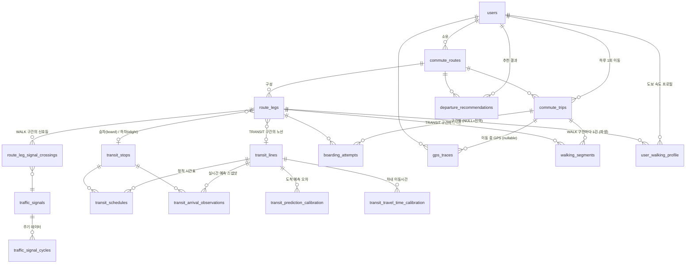

# 데이터 모델

전체 DDL은 [db/schema.sql](./db/schema.sql) 참고. 여기서는 엔티티별 의도와 관계를 설명한다.

## ER 다이어그램



## 계층 구조 한눈에

```
commute_route (경로 정의, 한 번 등록)
 └─ route_legs[]  WALK → TRANSIT → WALK → TRANSIT → WALK ...

commute_trip (그 경로로 실제 이동한 하루 1건)
 ├─ left_home_at / arrived_destination_at
 ├─ boarding_attempts[]  TRANSIT 구간마다: 정류장 도착, 차 출발, 하차, 탔음/놓침
 ├─ walking_segments[]   WALK 구간마다: 실제 걸린 시간/거리 (분석 배치가 파생)
 └─ gps_traces[]         원시 위치
```

## 엔티티 설명

### `users`
사용자. 앱/데스크탑/백엔드가 분리되어 있어 인증 주체가 필요하므로 처음부터 둔다.

### `commute_routes`
사용자가 등록한 "출퇴근 루틴" 단위. 예: "평일 출근 - 집→광역버스 M4403→GTX→회사".
`direction`으로 출근/퇴근을 구분한다. 같은 목적지라도 시간대별로 다른 루트를 쓸 수 있으므로
사용자당 여러 개 가질 수 있다.

### `route_legs`
`commute_route`를 구성하는 개별 구간을 순서(`seq_order`)대로 나열한 것.
- `WALK`: 시작/끝 좌표, 계획 거리
- `TRANSIT`: 노선(`transit_line_id`), 승차/하차 정류장, 차내 이동시간 초기값
  (`planned_travel_sec`). 버스/지하철/GTX 구분은 `transit_lines.mode`에서 가져온다
  (구간 쪽에 따로 두면 노선과 어긋날 수 있어서 한 곳에만 둔다).

이렇게 나눈 이유는 "최종 목적지 도착 시각"을 맞추려면 각 구간의 시간을 역산해서 더해야 하기
때문이다 (ALGORITHM.md 3절).

### `transit_lines` / `transit_stops`
노선과 정류장/역의 마스터 데이터. 외부 공공데이터 API의 ID를 `external_id`에 그대로
보관해서 동기화 잡이 upsert하기 쉽게 한다. `has_realtime_api=false`인 노선(예: GTX)은
정적 시간표만 쓴다.

### `transit_schedules`
정적 시간표. 실시간 API가 없는 노선의 fallback이자, 실시간 예측이 튈 때 비교 기준.

### `transit_arrival_observations`
외부 API가 특정 시점에 준 "예상 도착 시각"을 그대로 스냅샷으로 남긴다. 나중에
`boarding_attempts.vehicle_actual_departure_at`과 비교해서 "이 노선/시간대는 API가
평균 90초 늦게 예측한다" 같은 보정치를 계산하는 원재료다. 최신값만 덮어쓰지 않고 누적하는
이유가 이것.

### `commute_trips`
그 경로로 실제 이동한 하루 1건. `left_home_at`(집 geofence 이탈)과
`arrived_destination_at`(목적지 geofence 진입)은 경로 전체에 한 번씩만 존재하는 사건이므로
구간별 기록이 아니라 여기에 둔다. 추천 결과(`departure_recommendations`)와 1:1로 비교해서
"추천대로 나갔더니 실제로 됐는가"를 검증하는 단위이기도 하다.

### `boarding_attempts` — 핵심 테이블
한 trip 안에서 TRANSIT 구간마다 "이 차를 타려고 시도했다"는 사실을 기록한다.
- `arrived_at_stop_at`: 승차 정류장/역 도착 (geofence 진입)
- `vehicle_scheduled_or_predicted_at`: 그 순간 외부 API/시간표가 알려준 예정 시각
  (스냅샷 — 나중에 재현 가능하도록 값을 복사해 둔다)
- `vehicle_actual_departure_at`: 실제로 그 차가 떠난 시각 (탔으면 탑승 시각, 놓쳤으면
  목격한 출발 시각 — 가능한 경우만)
- `alighted_at`: 하차 정류장/역 도착 (geofence 진입)
- `result`: `CAUGHT` / `MISSED` / `UNKNOWN`

이 한 테이블에서 세 가지를 동시에 학습한다:
1. 도착 예측 오차 = `vehicle_actual_departure_at − vehicle_scheduled_or_predicted_at`
   → `transit_prediction_calibration`
2. 차내 이동시간 = `alighted_at − vehicle_actual_departure_at`
   → `transit_travel_time_calibration`
3. 도보 시간 = 앞 사건과 뒤 사건의 차이 (아래 `walking_segments`)

### `gps_traces`
원시 위치 로그. `commute_trip_id`가 있으면 그 이동 중 수집된 것, 없으면 상시 수집분.
대량으로 쌓이므로 일정 기간 후 압축/삭제하는 정책이 필요하다 (개발계획 참고).

### `walking_segments`
trip마다 WALK 구간별로 "실제 몇 초/몇 미터 걸렸는지"를 분석 배치가 파생해 넣는 테이블.
시작/끝 시각은 인접 사건에서 가져온다:
- 첫 WALK: `trip.left_home_at` → 첫 attempt의 `arrived_at_stop_at`
- 중간 WALK(환승): 앞 attempt의 `alighted_at` → 뒤 attempt의 `arrived_at_stop_at`
- 마지막 WALK: 마지막 attempt의 `alighted_at` → `trip.arrived_destination_at`

거리는 `gps_traces`로 계산하거나, GPS가 부실하면 `route_legs.planned_distance_m`을 쓴다.

### `user_walking_profile`
`walking_segments`를 누적 집계한 사용자의 평균 도보 속도(표준편차, 샘플 수 포함).
`route_leg_id`가 NULL이면 전역 기본 속도(새 구간에 데이터가 없을 때 fallback), 값이 있으면
그 구간 전용(오르막/계단/혼잡도가 달라 구간마다 다를 수 있음). 전역 행이 사용자당 하나만
있도록 `UNIQUE NULLS NOT DISTINCT`를 건다.

### `transit_prediction_calibration`
노선 × 정류장 × 요일유형 × 시간대별 "실제 − 예측"의 평균(`bias_sec`)과
표준편차(`stddev_sec`). 샘플이 없으면 bias 0, stddev 90초의 보수적 기본값으로 시작한다.

### `transit_travel_time_calibration`
노선 × 승차역 × 하차역 × 요일유형 × 시간대별 차내 이동시간의 평균/표준편차. 샘플이 없으면
`route_legs.planned_travel_sec`을 평균으로, 넉넉한 기본 표준편차로 시작한다.

### `traffic_signals` / `traffic_signal_cycles` / `route_leg_signal_crossings`
도보 구간 중 건너야 하는 횡단보도를 별도 마스터로 두고, 한 WALK 구간이 몇 번째로 어떤
신호등을 건너는지(`seq_order`)를 매핑한다. 신호 주기는 공공데이터로 채우거나, 없으면
사용자 관찰값(`source='USER_OBSERVED'`)이나 기본 가정값을 넣는다.

### `departure_recommendations`
Analytics가 계산한 최종 산출물. "이 경로로, 이 목표 도착 시각을 맞추려면, OO시 OO분에
나가라 (성공 확률 P)"를 기록한다. 앱/웹은 이 테이블을 읽기만 한다. 과거 추천도 삭제하지
않고 누적해서 같은 날짜의 `commute_trips`와 비교해 모델 성능을 추적한다.

## 왜 "예측"과 "실측"을 분리해서 저장하는가

이 프로젝트의 핵심은 외부 API의 정적/실시간 예측이 실제와 얼마나 다른지를 스스로
캘리브레이션하는 것이다. 그래서 스키마 전반에 "그 순간 시스템이 뭐라고 예측했는가"
(`transit_schedules`, `transit_arrival_observations`, attempt의 예정 시각 스냅샷)와
"실제로 무슨 일이 있었는가"(`commute_trips`, `boarding_attempts`, `walking_segments`)를
별도로 두고, 둘을 노선/구간/시간대 키로 조인해서 오차를 계산하는 구조로 설계했다. 값을
그 자리에서 덮어써버리면 이 오차 학습이 불가능해진다.
