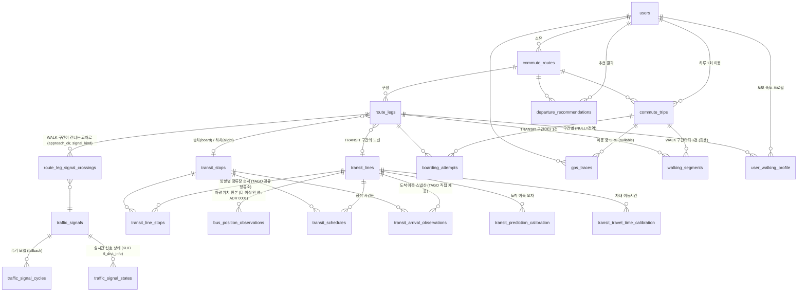

# 데이터 모델

DDL의 진실은 Flyway 마이그레이션
[`backend/src/main/resources/db/migration/V1__init_schema.sql`](../backend/src/main/resources/db/migration/V1__init_schema.sql)이고,
[db/schema.sql](./db/schema.sql)은 그 스냅샷이다. 여기서는 엔티티별 의도와 관계를 설명한다.

외부 마스터/실시간 데이터는 **버스는 TAGO**(국토교통부 전국버스), **신호등은 KLID**(한국지역정보개발원
전국통합데이터 `rti`)에서 온다 ([ADR 0001](./adr/0001-tago-bus-arrival-prediction.md)). 실시간 API가
없는 노선(GTX 등)은 `transit_schedules`의 정적 시간표를 쓴다. 연동 방식은
[ARCHITECTURE.md](./ARCHITECTURE.md)의 "외부 데이터 동기화" 참고.

## ER 다이어그램



## 계층 구조 한눈에

```
commute_route (경로 정의, 한 번 등록)
 └─ route_legs[]  WALK → TRANSIT → WALK → TRANSIT → WALK ...
      └─ (WALK) route_leg_signal_crossings[]  몇 번째로 어느 교차로의 어느 방향 보행신호를 건너는지

commute_trip (그 경로로 실제 이동한 하루 1건)
 ├─ left_home_at / arrived_destination_at
 ├─ boarding_attempts[]  TRANSIT 구간마다: 정류장 도착, 차 출발, 하차, 탔음/놓침
 ├─ walking_segments[]   WALK 구간마다: 실제 걸린 시간/거리 (분석 배치가 파생)
 └─ gps_traces[]         원시 위치

외부 데이터 (Backend 동기화 잡이 채움)
 ├─ 마스터: transit_lines / transit_stops / transit_line_stops / traffic_signals
 ├─ 실시간 원본: traffic_signal_states (bus_position_observations는 더 이상 안 씀, ADR 0001)
 └─ 도착 예측: transit_arrival_observations (버스는 TAGO가 직접 제공)
```

## 시간 규약

- `TIMESTAMPTZ`는 절대 시각(UTC). KLID가 주는 `totDt`/`gthrDt`(`yyyyMMddHHmmss`, KST)는
  `Asia/Seoul`로 파싱해 UTC로 저장한다.
- `TIME` 컬럼(시간표, 시간대)은 KST 기준 하루 중 시각. 반복되는 값이라 절대 시각이 아니다.

## 외부 ID와 지자체/도시 코드 `stdg_cd`

`stdg_cd`/`external_id`는 컬럼명이 KLID 초기 설계에서 왔지만 값의 의미는 **`mode`별로 다른
소스를 가리킨다** ([ADR 0001](./adr/0001-tago-bus-arrival-prediction.md)):

- `mode=BUS`: TAGO 기준. `stdg_cd`에는 TAGO `cityCode`, `external_id`에는 노선은
  `routeId`, 정류장은 `nodeId`가 들어간다. TAGO도 "그 도시 안에서만 ID가 유일"한 것은
  KLID와 같은 제약이라 같은 upsert 전략을 그대로 쓴다
- `mode=GTX`: 실시간 API가 없어 동기화 잡은 없지만, 시드(`db/seed/R__seed_gtx_a.sql`)가
  **멱등하려면 UNIQUE가 걸릴 키가 필요**하다. 그래서 `stdg_cd`에 노선 계열명(`GTX-A`),
  `external_id`에 GTX-A 공식 사이트가 쓰는 코드(노선 `L09`, 역 `X111` 동탄 / `X108` 수서)를
  넣는다. 지자체 코드가 아니라 "이 ID가 유일한 범위"를 가리키는 네임스페이스로 쓰는 것이다
- 신호등(`traffic_signals`): KLID 기준 그대로. `stdg_cd`는 **법정동 시도코드 10자리**
  (예: 서울 `1100000000`, 화성 `4159000000`), `crsrd_id`는 `crsrd_map_info.crsrdId`

두 코드 체계는 서로 다른 값 공간이지만 테이블이 분리(`transit_*` vs `traffic_signals`)돼
있어 섞이지 않는다. 어느 쪽이든 노선/정류장/교차로 ID는 **그 도시/지자체 안에서만 유일**하고
다른 지역이 같은 숫자 ID를 쓸 수 있으므로, 외부 ID만으로 UNIQUE를 걸면 동기화가 충돌한다.
그래서 마스터 세 테이블은 모두 `(…, stdg_cd, external_id)` 조합으로 UNIQUE를 걸고, 동기화
잡은 이 키로 upsert한다.

| 테이블 | UNIQUE 키 | 외부 ID 출처 |
|---|---|---|
| `transit_lines` | `(mode, stdg_cd, external_id)` | TAGO `getRouteNoList`/`getRouteAcctoThrghSttnList`의 `routeid` |
| `transit_stops` | `(mode, stdg_cd, external_id)` | TAGO `getRouteAcctoThrghSttnList`의 `nodeid` |
| `traffic_signals` | `(stdg_cd, crsrd_id)` | KLID `crsrd_map_info.crsrdId` |

수동 등록(GTX 역, 공공 데이터가 없는 신호등 등)은 `stdg_cd`/`external_id`를 NULL로 둔다.
PostgreSQL의 UNIQUE는 NULL을 서로 다른 값으로 취급하므로 수동 행은 몇 개든 들어간다.

## 엔티티 설명

### `users`
사용자. 앱/데스크탑/백엔드가 분리되어 있어 인증 주체가 필요하므로 처음부터 둔다. 1인 사용
단계에서는 `V2__seed_default_user.sql`이 넣는 `id=1` 사용자로 모든 요청이 귀속된다.

### `commute_routes`
사용자가 등록한 "출퇴근 루틴" 단위. 예: "평일 출근 - 집→광역버스 M4403→GTX→회사".
`direction`으로 출근/퇴근을 구분한다. 같은 목적지라도 시간대별로 다른 루트를 쓸 수 있으므로
사용자당 여러 개 가질 수 있다. `is_active`인 경로의 노선·교차로가 속한 지자체만 실시간 폴링
대상이 된다 (호출 한도 때문, ARCHITECTURE.md 참고).

### `route_legs`
`commute_route`를 구성하는 개별 구간을 순서(`seq_order`)대로 나열한 것.
- `WALK`: 시작/끝 좌표, 계획 거리
- `TRANSIT`: 노선(`transit_line_id`), 승차/하차 정류장, 차내 이동시간 초기값
  (`planned_travel_sec`). 버스/지하철/GTX 구분은 `transit_lines.mode`에서 가져온다
  (구간 쪽에 따로 두면 노선과 어긋날 수 있어서 한 곳에만 둔다).

이렇게 나눈 이유는 "최종 목적지 도착 시각"을 맞추려면 각 구간의 시간을 역산해서 더해야 하기
때문이다 (ALGORITHM.md 3절).

### `transit_lines` / `transit_stops`
노선과 정류장/역의 마스터 데이터. 버스는 TAGO `getRouteNoList`(노선 검색)와
`getRouteAcctoThrghSttnList`(경유 정류장)에서 동기화하며, 외부 ID와 `stdg_cd`(TAGO
`cityCode`)를 그대로 보관해서 upsert 키로 쓴다 (위 표). `has_realtime_api=false`인
노선(예: GTX)은 정적 시간표만 쓴다. `agency`에는 노선 유형/운수사 정도를 넣는다.

### `transit_line_stops`
노선의 **방향별 정류장 순서**. TAGO `getRouteAcctoThrghSttnList` 한 행 = 이 테이블 한 행이며
`(transit_line_id, direction_code, seq_no=nodeord)`으로 유일하다.

GTX처럼 TAGO 동기화 대상이 아닌 노선은 시드(`db/seed/R__seed_gtx_a.sql`)로 채운다. 비어 있으면
`LegDirectionResolver.resolve()`가 그 노선 구간에 대해 `null`을 돌려주고, `transit_schedules` 조회에
넘길 방향이 없어진다.

TAGO는 정류장 단위 도착예측을 직접 주므로 이 순서를 ETA 계산(폴리라인 투영)에 쓰지는 않는다.
그래도 노선-정류장 관계 자체(구간 등록 시 "이 노선이 지나가는 정류장" 검색/표시, 승차·하차
정류장이 실제로 그 노선 위에 있는지 검증)에 필요해서 계속 채운다. `direction_code`가 다르면
같은 노선도 정류장 순서가 다르므로 방향별로 나눈다.

### `bus_position_observations`
과거 KLID 버스 위치 기반 설계(위치→ETA 기하 계산, [ADR 0001](./adr/0001-tago-bus-arrival-prediction.md))의
산물이다. TAGO는 위치가 아니라 도착예측을 직접 주므로 이 테이블은 **더 이상 적재되지 않는다**.
이미 머지된 마이그레이션은 손대지 않는 컨벤션에 따라 테이블 자체는 남아 있지만 코드에서 쓰지
않는다. (한 행 = 차량 1대 × 수집시각 1개였고, `raw` JSONB에 원본 필드를 남겨 두는 구조였다 —
과거 이력 참고용으로만 기록해 둔다.)

### `transit_schedules`
정적 시간표. 실시간 API가 없는 노선의 fallback이자, 실시간 예측이 튈 때 비교 기준.
TAGO 노선 정보의 첫차/막차는 시간표가 아니라 운행 범위이므로 여기 넣지 않는다.

적재는 `POST /admin/schedules/import`(multipart CSV, [API.md](./API.md) "정적 시간표"),
조회는 `GET /transit-lines/{id}/schedules/next`. `scheduled_time`은 KST 벽시계라 조회할 때
운행일을 붙여 UTC 절대 시각으로 바꿔 내보낸다. 어느 시간표를 볼지는 KST 날짜 → `day_type`
매핑(`DayTypeResolver`, 공휴일은 `calendar/kr-holidays.txt` 수동 목록)으로 정한다.

`direction_code`는 **`transit_line_stops`와 같은 어휘**다 (KLID `drcGbnCd`, GTX-A는 `UP`=수서 방면 /
`DN`=동탄 방면). 한 정류장은 거의 항상 상·하행 양쪽에 서므로, 방향이 없으면 "다음 차"가 반대 방향
차를 섞어 돌려준다. 새 enum을 만들지 않은 이유는 구간의 방향을 정하는 `LegDirectionResolver`가
`transit_line_stops.direction_code`를 그대로 돌려주기 때문이다 — 두 테이블이 같은 값이어야 비교가
변환 없이 된다. 사업자마다 코드값이 달라(`0`/`1`, `UP`/`DN`) enum으로 고정하면 노선을 추가할 때마다
마이그레이션이 생기는 것도 이유다. 조회 인덱스는
`(transit_line_id, stop_id, day_type, direction_code, scheduled_time)`이다.

UNIQUE 제약이 없는 것은 의도다. import는 (노선, 정류장, `day_type`, `direction_code`) 조합 단위로
기존 행을 지우고 다시 넣어 멱등성을 얻는데, UNIQUE 기반 upsert로는 개정으로 없어진 차편이 남는다.
방향이 이 키에 들어가야 상행 파일을 넣을 때 같은 정류장의 하행 행이 같이 지워지지 않는다.

### `transit_arrival_observations`
"이 시점에 시스템이 받은 정류장 도착 예정 시각"의 스냅샷. 버스는 **TAGO가 정류장 단위로
직접 주는 도착예측**(`getSttnAcctoSpecifyRouteBusArvlPrearngeInfoList`의 `arrtime`)을 그대로
받아 적재한다 (`source='TAGO_ARVL'`). TAGO는 차량 식별자를 주지 않으므로 `vehicle_no`는
보통 NULL이다(컬럼 자체는 nullable). 이전 KLID 버스 위치 기반 설계 때는 Backend가
`bus_position_observations`를 `transit_line_stops` 폴리라인에 투영해 파생한 ETA였다
(`source='KLID_RTM_LOC_ETA'`, 지금은 쓰지 않음). 스키마는 처음부터 소스 중립으로 설계돼
있어서(`source` 컬럼) 이 교체에 마이그레이션이 필요 없었다.

이 값은 `boarding_attempts.vehicle_actual_departure_at`과 비교해서 "이 노선/시간대는 예측이
평균 90초 늦다" 같은 보정치를 계산하는 원재료다. 최신값만 덮어쓰지 않고 누적하는 이유가 이것.

### `traffic_signals` — 한 행 = 교차로
KLID `crsrd_map_info`의 **교차로(intersection)** 하나가 한 행이다. 횡단보도 하나가 아니다.
좌표(`lat`/`lng`)는 교차로 중심점(`mapCtptIntLat/Lot`)이고 `crsrd_id`+`stdg_cd`가 외부 키다.
공공 데이터가 없는 곳은 좌표만으로 수동 등록한다(`crsrd_id` NULL).

교차로 단위로 두는 이유: KLID 실시간 신호(`tl_drct_info`)가 교차로 ID 하나에 접근방향 8개 ×
신호종류 6개의 상태를 한 행으로 주기 때문이다. "어느 횡단보도"는 아래 crossing이 방향/종류로
지정한다.

### `route_leg_signal_crossings` — 어느 방향의 어떤 신호를 건너는가
WALK 구간이 몇 번째(`seq_order`)로 어느 교차로(`traffic_signal_id`)를 건너는지에 더해,
- `approach_dir`: `nt, et, st, wt, ne, se, sw, nw` — 교차로 기준 접근 방향 (북/동/남/서/북동/…)
- `signal_kind`: `Bs, Bc, Lt, Pd, St, Ut` — 신호 종류. 보행자는 `Pd`(기본값). `St`(직진)/`Lt`(좌회전)
  등은 보행 신호가 제공되지 않는 교차로에서 대체 지표로 쓸 여지를 남긴 것

두 코드는 KLID `tl_drct_info` 필드명 접두어와 **정확히 같은 문자열**이다
(`ntPdsgRmndCs` = `nt` + `Pd` + `sgRmndCs`). 그래서 실시간 행을 찾을 때 변환 없이
`(traffic_signal_id, approach_dir, signal_kind)`로 바로 조인할 수 있다.

### `traffic_signal_states`
KLID `tl_drct_info`의 실시간 신호 상태를 정규화한 테이블. API 한 행(교차로 1개, 96개 필드)을
**교차로 × 접근방향 × 신호종류 × 수집시각당 1행**으로 풀어서 넣는다. 값이 빈 문자열인 방향/종류
조합(그 교차로에 없는 신호)은 행을 만들지 않는다.
- `status`: SAE J2735 `MovementPhaseState` 문자열(`protected-Movement-Allowed`,
  `stop-And-Remain`, `permissive-Movement-Allowed`, `protected-clearance`, `unavailable`, `dark`…)을
  받은 그대로. enum으로 제한하지 않는 이유는 포털 문서에 값 목록이 없고 새 값이 나와도 적재가
  멈추면 안 되기 때문. 해석(녹색/적색 분류)은 ALGORITHM.md에서 한다.
- `remaining_ds`: 남은 시간, **데시초**(0.1초). 원본 `36001`은 "알 수 없음"이라 NULL.

이 테이블이 있으면 신호 주기를 추정할 필요 없이 "지금 이 횡단보도는 몇 초 뒤에 바뀐다"를
그대로 계산에 쓸 수 있다 (ALGORITHM.md 2.1). 커버 지역이 아닌 곳은 아래 주기 모델로 돌아간다.

**현재 이 테이블은 비어 있다.** `tl_drct_info`는 2026-09 기준 **울산광역시에서만** 데이터를
주고, 우리 대상 지자체(서울·성남·화성)는 모두 `K3` NODATA다 — 서울은 교차로 정적 지도
(`crsrd_map_info`, 2,779건)만 있고 실시간 위상은 0건이다 (#30,
[ARCHITECTURE.md](./ARCHITECTURE.md) "신호등 커버리지"). 따라서 모든 횡단보도가 주기 모델로
떨어진다. 스키마와 적재 코드는 그대로 두는데, 커버리지가 늘면 변경 없이 바로 채워지기 때문이다.

### `traffic_signal_cycles`
신호 **주기 모델**: 요일유형 × 시간대별 적색 길이/주기 길이. 실시간 상태가 없는 교차로의
fallback이고, 실시간이 있어도 "지금 현시 이후"를 추정할 때 주기 길이를 빌려 쓴다.
공공 데이터로 채우거나(`PUBLIC_API`), 사용자 관찰값(`USER_OBSERVED`), 기본 가정값
(`DEFAULT_ASSUMPTION`)을 넣는다.

### `commute_trips`
그 경로로 실제 이동한 하루 1건. `left_home_at`(집 geofence 이탈)과
`arrived_destination_at`(목적지 geofence 진입)은 경로 전체에 한 번씩만 존재하는 사건이므로
구간별 기록이 아니라 여기에 둔다. 추천 결과(`departure_recommendations`)와 1:1로 비교해서
"추천대로 나갔더니 실제로 됐는가"를 검증하는 단위이기도 하다.

### `boarding_attempts` — 핵심 테이블
한 trip 안에서 TRANSIT 구간마다 "이 차를 타려고 시도했다"는 사실을 기록한다.
- `arrived_at_stop_at`: 승차 정류장/역 도착 (geofence 진입)
- `vehicle_scheduled_or_predicted_at`: 그 순간 시스템이 알려준 예정 시각
  (스냅샷 — 나중에 재현 가능하도록 값을 복사해 둔다)
- `vehicle_actual_departure_at`: 실제로 그 차가 떠난 시각 (탔으면 탑승 시각, 놓쳤으면
  목격한 출발 시각 — 가능한 경우만)
- `alighted_at`: 하차 정류장/역 도착 (geofence 진입)
- `result`: `CAUGHT` / `MISSED` / `UNKNOWN`

`(commute_trip_id, route_leg_id)` UNIQUE라 같은 구간의 재전송은 API에서 upsert로 흡수한다.

이 한 테이블에서 세 가지를 동시에 학습한다:
1. 도착 예측 오차 = `vehicle_actual_departure_at − vehicle_scheduled_or_predicted_at`
   → `transit_prediction_calibration`
2. 차내 이동시간 = `alighted_at − vehicle_actual_departure_at`
   → `transit_travel_time_calibration`
3. 도보 시간 = 앞 사건과 뒤 사건의 차이 (아래 `walking_segments`)

### `gps_traces`
원시 위치 로그. `commute_trip_id`가 있으면 그 이동 중 수집된 것, 없으면 상시 수집분.
`(user_id, recorded_at)` UNIQUE + `ON CONFLICT DO NOTHING`으로 앱의 오프라인 재전송을 흡수한다.
대량으로 쌓이므로 일정 기간 후 압축/삭제하는 정책이 필요하다 (개발계획 참고).

### `walking_segments`
trip마다 WALK 구간별로 "실제 몇 초/몇 미터 걸렸는지"를 분석 배치가 파생해 넣는 테이블.
시작/끝 시각은 인접 사건에서 가져온다:
- 첫 WALK: `trip.left_home_at` → 첫 attempt의 `arrived_at_stop_at`
- 중간 WALK(환승): 앞 attempt의 `alighted_at` → 뒤 attempt의 `arrived_at_stop_at`
- 마지막 WALK: 마지막 attempt의 `alighted_at` → `trip.arrived_destination_at`

거리는 `gps_traces`로 계산하거나, GPS가 부실하면 `route_legs.planned_distance_m`을 쓴다.

### `user_walking_profile`
`walking_segments`를 누적 집계한 사용자의 평균 도보 속도(표준편차, 샘플 수 포함).
`route_leg_id`가 NULL이면 전역 기본 속도(새 구간에 데이터가 없을 때 fallback), 값이 있으면
그 구간 전용(오르막/계단/혼잡도가 달라 구간마다 다를 수 있음). 전역 행이 사용자당 하나만
있도록 `UNIQUE NULLS NOT DISTINCT`를 건다.

### `transit_prediction_calibration`
노선 × 정류장 × 요일유형 × 시간대별 "실제 − 예측"의 평균(`bias_sec`)과
표준편차(`stddev_sec`). 샘플이 없으면 bias 0, stddev 90초의 보수적 기본값으로 시작한다.
예측이 우리가 파생한 ETA이므로, 이 보정치는 곧 "우리 투영 로직의 체계적 오차"이기도 하다.

### `transit_travel_time_calibration`
노선 × 승차역 × 하차역 × 요일유형 × 시간대별 차내 이동시간의 평균/표준편차. 샘플이 없으면
`route_legs.planned_travel_sec`을 평균으로, 넉넉한 기본 표준편차로 시작한다.

### `departure_recommendations`
Analytics가 계산한 최종 산출물. "이 경로로, 이 목표 도착 시각을 맞추려면, OO시 OO분에
나가라 (성공 확률 P)"를 기록한다. 앱/웹은 이 테이블을 읽기만 한다. 과거 추천도 삭제하지
않고 누적해서 같은 날짜의 `commute_trips`와 비교해 모델 성능을 추적한다.

## 왜 "예측"과 "실측"을 분리해서 저장하는가

이 프로젝트의 핵심은 외부 데이터에서 만든 정적/실시간 예측이 실제와 얼마나 다른지를 스스로
캘리브레이션하는 것이다. 그래서 스키마 전반에 "그 순간 시스템이 뭐라고 예측했는가"
(`transit_schedules`, `transit_arrival_observations`, attempt의 예정 시각 스냅샷)와
"실제로 무슨 일이 있었는가"(`commute_trips`, `boarding_attempts`, `walking_segments`)를
별도로 두고, 둘을 노선/구간/시간대 키로 조인해서 오차를 계산하는 구조로 설계했다. 값을
그 자리에서 덮어써버리면 이 오차 학습이 불가능해진다.

같은 이유로 실시간 원본(`bus_position_observations`, `traffic_signal_states`)도 최신값만
유지하지 않고 수집시각별로 쌓는다. 파생 로직이 바뀌면 원본으로 다시 계산해 비교해야 한다.
