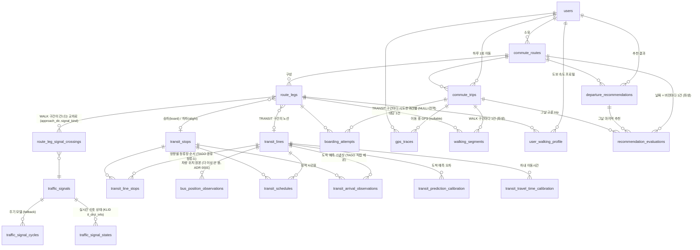

# 데이터 모델

DDL의 진실은 Flyway 마이그레이션
[`backend/src/main/resources/db/migration/V1__init_schema.sql`](../backend/src/main/resources/db/migration/V1__init_schema.sql)이고,
[db/schema.sql](./db/schema.sql)은 그 스냅샷이다. 여기서는 엔티티별 의도와 관계를 설명한다.

외부 마스터/실시간 데이터는 **버스는 TAGO**(국토교통부 전국버스), **신호등은 KLID**(한국지역정보개발원
전국통합데이터 `rti`)에서 온다 ([ADR 0001](./adr/0001-tago-bus-arrival-prediction.md)). 실시간 API가
없는 노선(GTX 등)은 `transit_schedules`의 정적 시간표를 쓴다. 연동 방식은
[ARCHITECTURE.md](./ARCHITECTURE.md)의 "외부 데이터 동기화" 참고.

## ER 다이어그램


```mermaid
erDiagram
    users ||--o{ commute_routes : "소유"
    commute_routes ||--o{ route_legs : "구성"
    route_legs }o--o| transit_lines : "TRANSIT 구간의 노선"
    route_legs }o--o| transit_stops : "승차(board) / 하차(alight)"
    route_legs ||--o{ route_leg_signal_crossings : "WALK 구간이 건너는 교차로 (approach_dir, signal_kind)"
    route_leg_signal_crossings }o--|| traffic_signals : ""
    traffic_signals ||--o{ traffic_signal_cycles : "주기 모델 (fallback)"
    traffic_signals ||--o{ traffic_signal_states : "실시간 신호 상태 (KLID tl_drct_info)"

    transit_lines ||--o{ transit_line_stops : "방향별 정류장 순서 (TAGO 경유정류소)"
    transit_stops ||--o{ transit_line_stops : ""
    transit_lines ||--o{ bus_position_observations : "차량 위치 원본 (더 이상 안 씀, ADR 0001)"
    transit_lines ||--o{ transit_schedules : "정적 시간표"
    transit_lines ||--o{ transit_arrival_observations : "도착 예측 스냅샷 (TAGO 직접 제공)"
    transit_stops ||--o{ transit_schedules : ""
    transit_stops ||--o{ transit_arrival_observations : ""

    users ||--o{ commute_trips : "하루 1회 이동"
    commute_routes ||--o{ commute_trips : ""
    commute_trips ||--o{ boarding_attempts : "TRANSIT 구간마다 시도한 차 한 대당 1건"
    route_legs ||--o{ boarding_attempts : ""
    commute_trips ||--o{ gps_traces : "이동 중 GPS (nullable)"
    users ||--o{ gps_traces : ""

    commute_trips ||--o{ walking_segments : "WALK 구간마다 1건 (파생)"
    route_legs ||--o{ walking_segments : ""
    users ||--o{ user_walking_profile : "도보 속도 프로필"
    route_legs ||--o{ user_walking_profile : "구간별 (NULL=전역)"

    transit_lines ||--o{ transit_prediction_calibration : "도착 예측 오차"
    transit_lines ||--o{ transit_travel_time_calibration : "차내 이동시간"

    users ||--o{ departure_recommendations : "추천 결과"
    commute_routes ||--o{ departure_recommendations : ""

    commute_routes ||--o{ recommendation_evaluations : "날짜 × 버전마다 1건 (파생)"
    departure_recommendations ||--o{ recommendation_evaluations : "그날 마지막 추천"
    commute_trips ||--o{ recommendation_evaluations : "그날 고른 trip"
```

## 계층 구조 한눈에

```
commute_route (경로 정의, 한 번 등록)
 └─ route_legs[]  WALK → TRANSIT → WALK → TRANSIT → WALK ...
      └─ (WALK) route_leg_signal_crossings[]  몇 번째로 어느 교차로의 어느 방향 보행신호를 건너는지

commute_trip (그 경로로 실제 이동한 하루 1건)
 ├─ left_home_at / arrived_destination_at
 ├─ boarding_attempts[]  TRANSIT 구간마다, 시도한 차 한 대당: 정류장 도착, 차 출발, 하차, 탔음/놓침
 ├─ walking_segments[]   WALK 구간마다: 실제 걸린 시간/거리 (분석 배치가 파생)
 └─ gps_traces[]         원시 위치

외부 데이터 (Backend 동기화 잡이 채움)
 ├─ 마스터: transit_lines / transit_stops / transit_line_stops / traffic_signals
 ├─ 실시간 원본: traffic_signal_states (bus_position_observations는 더 이상 안 씀, ADR 0001)
 └─ 도착 예측: transit_arrival_observations (버스는 TAGO가 직접 제공)
```

## 시간 규약

- `TIMESTAMPTZ`는 절대 시각(UTC). KLID가 주는 `totDt`/`gthrDt`(`yyyyMMddHHmmss`, KST)는
  `Asia/Seoul`로 파싱해 UTC로 저장한다.
- `TIME` 컬럼(시간표, 시간대)은 KST 기준 하루 중 시각. 반복되는 값이라 절대 시각이 아니다.

## 외부 ID와 지자체/도시 코드 `stdg_cd`

`stdg_cd`/`external_id`는 컬럼명이 KLID 초기 설계에서 왔지만 값의 의미는 **`mode`별로 다른
소스를 가리킨다** ([ADR 0001](./adr/0001-tago-bus-arrival-prediction.md)):

- `mode=BUS`: TAGO 기준. `stdg_cd`에는 TAGO `cityCode`, `external_id`에는 노선은
  `routeId`, 정류장은 `nodeId`가 들어간다. TAGO도 "그 도시 안에서만 ID가 유일"한 것은
  KLID와 같은 제약이라 같은 upsert 전략을 그대로 쓴다
- `mode=GTX`: 실시간 API가 없어 동기화 잡은 없지만, 시드(`db/seed/R__seed_gtx_a.sql`)가
  **멱등하려면 UNIQUE가 걸릴 키가 필요**하다. 그래서 `stdg_cd`에 노선 계열명(`GTX-A`),
  `external_id`에 GTX-A 공식 사이트가 쓰는 코드(노선 `L09`, 역 `X111` 동탄 / `X108` 수서)를
  넣는다. 지자체 코드가 아니라 "이 ID가 유일한 범위"를 가리키는 네임스페이스로 쓰는 것이다
- 신호등(`traffic_signals`): KLID 기준 그대로. `stdg_cd`는 **법정동 시도코드 10자리**
  (예: 서울 `1100000000`, 화성 `4159000000`), `crsrd_id`는 `crsrd_map_info.crsrdId`

두 코드 체계는 서로 다른 값 공간이지만 테이블이 분리(`transit_*` vs `traffic_signals`)돼
있어 섞이지 않는다. 어느 쪽이든 노선/정류장/교차로 ID는 **그 도시/지자체 안에서만 유일**하고
다른 지역이 같은 숫자 ID를 쓸 수 있으므로, 외부 ID만으로 UNIQUE를 걸면 동기화가 충돌한다.
그래서 마스터 세 테이블은 모두 `(…, stdg_cd, external_id)` 조합으로 UNIQUE를 걸고, 동기화
잡은 이 키로 upsert한다.

| 테이블 | UNIQUE 키 | 외부 ID 출처 |
|---|---|---|
| `transit_lines` | `(mode, stdg_cd, external_id)` | TAGO `getRouteNoList`/`getRouteAcctoThrghSttnList`의 `routeid` |
| `transit_stops` | `(mode, stdg_cd, external_id)` | TAGO `getRouteAcctoThrghSttnList`의 `nodeid` |
| `traffic_signals` | `(stdg_cd, crsrd_id)` | KLID `crsrd_map_info.crsrdId` |

수동 등록(GTX 역, 공공 데이터가 없는 신호등 등)은 `stdg_cd`/`external_id`를 NULL로 둔다.
PostgreSQL의 UNIQUE는 NULL을 서로 다른 값으로 취급하므로 수동 행은 몇 개든 들어간다.

## 엔티티 설명

### `users`
사용자. 앱/데스크탑/백엔드가 분리되어 있어 인증 주체가 필요하므로 처음부터 둔다. 1인 사용
단계에서는 `V2__seed_default_user.sql`이 넣는 `id=1` 사용자로 모든 요청이 귀속된다.

### `commute_routes`
사용자가 등록한 "출퇴근 루틴" 단위. 예: "평일 출근 - 집→광역버스 M4403→GTX→회사".
`direction`으로 출근/퇴근을 구분한다. 같은 목적지라도 시간대별로 다른 루트를 쓸 수 있으므로
사용자당 여러 개 가질 수 있다. `is_active`인 경로의 노선·교차로가 속한 지자체만 실시간 폴링
대상이 된다 (호출 한도 때문, ARCHITECTURE.md 참고).

**기본 목표 도착 시각** (V6, #68): `default_target_arrival_time`(TIME, KST 벽시계, NULL 가능)과
`default_target_day_types`(`day_type[]`, 기본 `{WEEKDAY}`, 비어 있을 수 없음). analytics의
`recommend --all-active-routes`가 활성 경로마다 그날 날짜 + 이 시각을 목표로 계산한다. 목표 시각이 없거나
그날의 `day_type`(시간표·보정 테이블과 같은 공휴일 목록으로 판정, 공휴일은 `SUNDAY_HOLIDAY`)이 집합에 없으면
건너뛴다. 요일 마스크 대신 `day_type` 집합을 쓰는 것은 시간표와 같은 달력을 쓰기 위해서다 — "평일 출근"
경로는 공휴일에 돌지 않는다. JPA는 enum 배열을 `varchar[]`로 바인딩하므로 엔티티가 쓰기에 `?::day_type[]`
캐스트를 붙인다(`@ColumnTransformer`).

### `route_legs`
`commute_route`를 구성하는 개별 구간을 순서(`seq_order`)대로 나열한 것.
- `WALK`: 시작/끝 좌표, 계획 거리
- `TRANSIT`: 노선(`transit_line_id`), 승차/하차 정류장, 차내 이동시간 초기값
  (`planned_travel_sec`). 버스/지하철/GTX 구분은 `transit_lines.mode`에서 가져온다
  (구간 쪽에 따로 두면 노선과 어긋날 수 있어서 한 곳에만 둔다).

이렇게 나눈 이유는 "최종 목적지 도착 시각"을 맞추려면 각 구간의 시간을 역산해서 더해야 하기
때문이다 (ALGORITHM.md 3절).

### `transit_lines` / `transit_stops`
노선과 정류장/역의 마스터 데이터. 버스는 TAGO `getRouteNoList`(노선 검색)와
`getRouteAcctoThrghSttnList`(경유 정류장)에서 동기화하며, 외부 ID와 `stdg_cd`(TAGO
`cityCode`)를 그대로 보관해서 upsert 키로 쓴다 (위 표). `has_realtime_api=false`인
노선(예: GTX)은 정적 시간표만 쓴다. `agency`에는 노선 유형/운수사 정도를 넣는다.

### `transit_line_stops`
노선의 **방향별 정류장 순서**. TAGO `getRouteAcctoThrghSttnList` 한 행 = 이 테이블 한 행이며
`(transit_line_id, direction_code, seq_no=nodeord)`으로 유일하다. `direction_code`는 TAGO `updowncd`
(`0`/`1`)인데, **경기(`GGB…`) 노선은 `updowncd`를 주지 않아 전부 `"0"`**이다 — 기점→회차→기점이
`nodeord` 하나로 이어지고 왕복 정류장의 `nodeId`가 달라 순서만으로 방향이 정해진다. `…(미정차)`
통과 지점 행은 적재하지 않으므로 `seq_no`에 빈 번호가 생긴다 (#17).

GTX처럼 TAGO 동기화 대상이 아닌 노선은 시드(`db/seed/R__seed_gtx_a.sql`)로 채운다. 비어 있으면
`LegDirectionResolver.resolve()`가 그 노선 구간에 대해 `null`을 돌려주고, `transit_schedules` 조회에
넘길 방향이 없어진다.

TAGO는 정류장 단위 도착예측을 직접 주므로 이 순서를 ETA 계산(폴리라인 투영)에 쓰지는 않는다.
그래도 노선-정류장 관계 자체(구간 등록 시 "이 노선이 지나가는 정류장" 검색/표시, 승차·하차
정류장이 실제로 그 노선 위에 있는지 검증)에 필요해서 계속 채운다. `direction_code`가 다르면
같은 노선도 정류장 순서가 다르므로 방향별로 나눈다.

### `bus_position_observations`
과거 KLID 버스 위치 기반 설계(위치→ETA 기하 계산, [ADR 0001](./adr/0001-tago-bus-arrival-prediction.md))의
산물이다. TAGO는 위치가 아니라 도착예측을 직접 주므로 이 테이블은 **더 이상 적재되지 않는다**.
이미 머지된 마이그레이션은 손대지 않는 컨벤션에 따라 테이블 자체는 남아 있지만 코드에서 쓰지
않는다. (한 행 = 차량 1대 × 수집시각 1개였고, `raw` JSONB에 원본 필드를 남겨 두는 구조였다 —
과거 이력 참고용으로만 기록해 둔다.)

### `transit_schedules`
정적 시간표. 실시간 API가 없는 노선의 fallback이자, 실시간 예측이 튈 때 비교 기준.
TAGO 노선 정보의 첫차/막차는 시간표가 아니라 운행 범위이므로 여기 넣지 않는다.

적재는 `POST /admin/schedules/import`(multipart CSV, [API.md](./API.md) "정적 시간표"),
조회는 `GET /transit-lines/{id}/schedules/next`. `scheduled_time`은 KST 벽시계라 조회할 때
운행일을 붙여 UTC 절대 시각으로 바꿔 내보낸다. 어느 시간표를 볼지는 KST 날짜 → `day_type`
매핑(`DayTypeResolver`, 공휴일은 `calendar/kr-holidays.txt` 수동 목록)으로 정한다.

`direction_code`는 **`transit_line_stops`와 같은 어휘**다 (KLID `drcGbnCd`, GTX-A는 `UP`=수서 방면 /
`DN`=동탄 방면). 한 정류장은 거의 항상 상·하행 양쪽에 서므로, 방향이 없으면 "다음 차"가 반대 방향
차를 섞어 돌려준다. 새 enum을 만들지 않은 이유는 구간의 방향을 정하는 `LegDirectionResolver`가
`transit_line_stops.direction_code`를 그대로 돌려주기 때문이다 — 두 테이블이 같은 값이어야 비교가
변환 없이 된다. 사업자마다 코드값이 달라(`0`/`1`, `UP`/`DN`) enum으로 고정하면 노선을 추가할 때마다
마이그레이션이 생기는 것도 이유다. 조회 인덱스는
`(transit_line_id, stop_id, day_type, direction_code, scheduled_time)`이다.

UNIQUE 제약이 없는 것은 의도다. import는 (노선, 정류장, `day_type`, `direction_code`) 조합 단위로
기존 행을 지우고 다시 넣어 멱등성을 얻는데, UNIQUE 기반 upsert로는 개정으로 없어진 차편이 남는다.
방향이 이 키에 들어가야 상행 파일을 넣을 때 같은 정류장의 하행 행이 같이 지워지지 않는다.

### `transit_arrival_observations`
"이 시점에 시스템이 받은 정류장 도착 예정 시각"의 스냅샷. 버스는 **TAGO가 정류장 단위로
직접 주는 도착예측**(`getSttnAcctoSpcifyRouteBusArvlPrearngeInfoList`의 `arrtime`)을 그대로
받아 적재한다 (`source='TAGO_ARVL'`). TAGO는 차량 식별자를 주지 않으므로 `vehicle_no`는
보통 NULL이다(컬럼 자체는 nullable). 이전 KLID 버스 위치 기반 설계 때는 Backend가
`bus_position_observations`를 `transit_line_stops` 폴리라인에 투영해 파생한 ETA였다
(`source='KLID_RTM_LOC_ETA'`, 지금은 쓰지 않음). 스키마는 처음부터 소스 중립으로 설계돼
있어서(`source` 컬럼) 이 교체에 마이그레이션이 필요 없었다.

이 값은 `boarding_attempts.vehicle_actual_departure_at`과 비교해서 "이 노선/시간대는 예측이
평균 90초 늦다" 같은 보정치를 계산하는 원재료다. 최신값만 덮어쓰지 않고 누적하는 이유가 이것.

한 번의 폴링 조회(노선 × 정류장)가 돌려준 차량들은 같은 `observed_at`으로 들어간다. 그래서
"관측 묶음" = `(transit_line_id, stop_id, observed_at)`이 같은 행들이다. 탑승 시도의 예측 스냅샷은
기준 시각 2분 이내의 가장 최근 묶음에서 기준 이후 가장 이른 `predicted_arrival_at`을 고른다 (#54).
조회는 `idx_arrival_obs_lookup (transit_line_id, stop_id, observed_at)`을 탄다.

### `traffic_signals` — 한 행 = 교차로
KLID `crsrd_map_info`의 **교차로(intersection)** 하나가 한 행이다. 횡단보도 하나가 아니다.
좌표(`lat`/`lng`)는 교차로 중심점(`mapCtptIntLat/Lot`)이고 `crsrd_id`+`stdg_cd`가 외부 키다.
공공 데이터가 없는 곳은 좌표만으로 수동 등록한다(`crsrd_id` NULL).

교차로 단위로 두는 이유: KLID 실시간 신호(`tl_drct_info`)가 교차로 ID 하나에 접근방향 8개 ×
신호종류 6개의 상태를 한 행으로 주기 때문이다. "어느 횡단보도"는 아래 crossing이 방향/종류로
지정한다.

### `route_leg_signal_crossings` — 어느 방향의 어떤 신호를 건너는가
WALK 구간이 몇 번째(`seq_order`)로 어느 교차로(`traffic_signal_id`)를 건너는지에 더해,
- `approach_dir`: `nt, et, st, wt, ne, se, sw, nw` — 교차로 기준 접근 방향 (북/동/남/서/북동/…)
- `signal_kind`: `Bs, Bc, Lt, Pd, St, Ut` — 신호 종류. 보행자는 `Pd`(기본값). `St`(직진)/`Lt`(좌회전)
  등은 보행 신호가 제공되지 않는 교차로에서 대체 지표로 쓸 여지를 남긴 것

두 코드는 KLID `tl_drct_info` 필드명 접두어와 **정확히 같은 문자열**이다
(`ntPdsgRmndCs` = `nt` + `Pd` + `sgRmndCs`). 그래서 실시간 행을 찾을 때 변환 없이
`(traffic_signal_id, approach_dir, signal_kind)`로 바로 조인할 수 있다.

### `traffic_signal_states`
KLID `tl_drct_info`의 실시간 신호 상태를 정규화한 테이블. API 한 행(교차로 1개, 96개 필드)을
**교차로 × 접근방향 × 신호종류 × 수집시각당 1행**으로 풀어서 넣는다. 값이 빈 문자열인 방향/종류
조합(그 교차로에 없는 신호)은 행을 만들지 않는다.
- `status`: SAE J2735 `MovementPhaseState` 문자열(`protected-Movement-Allowed`,
  `stop-And-Remain`, `permissive-Movement-Allowed`, `protected-clearance`, `unavailable`, `dark`…)을
  받은 그대로. enum으로 제한하지 않는 이유는 포털 문서에 값 목록이 없고 새 값이 나와도 적재가
  멈추면 안 되기 때문. 해석(녹색/적색 분류)은 ALGORITHM.md에서 한다.
- `remaining_ds`: 남은 시간, **데시초**(0.1초). 원본 `36001`은 "알 수 없음"이라 NULL.

이 테이블이 있으면 신호 주기를 추정할 필요 없이 "지금 이 횡단보도는 몇 초 뒤에 바뀐다"를
그대로 계산에 쓸 수 있다 (ALGORITHM.md 2.1). 커버 지역이 아닌 곳은 아래 주기 모델로 돌아간다.

**현재 이 테이블은 비어 있다.** `tl_drct_info`는 2026-09 기준 **울산광역시에서만** 데이터를
주고, 우리 대상 지자체(서울·성남·화성)는 모두 `K3` NODATA다 — 서울은 교차로 정적 지도
(`crsrd_map_info`, 2,779건)만 있고 실시간 위상은 0건이다 (#30,
[ARCHITECTURE.md](./ARCHITECTURE.md) "신호등 커버리지"). 따라서 모든 횡단보도가 주기 모델로
떨어진다. 스키마와 적재 코드는 그대로 두는데, 커버리지가 늘면 변경 없이 바로 채워지기 때문이다.

### `traffic_signal_cycles`
신호 **주기 모델**: 요일유형 × 시간대별 적색 길이/주기 길이. 실시간 상태가 없는 교차로의
fallback이고, 실시간이 있어도 "지금 현시 이후"를 추정할 때 주기 길이를 빌려 쓴다.
공공 데이터로 채우거나(`PUBLIC_API`), 사용자 관찰값(`USER_OBSERVED`), 기본 가정값
(`DEFAULT_ASSUMPTION`)을 넣는다.

- **시간대**: KST 하루 중 `[time_band_start, time_band_end)`. 자정을 넘지 않는다(넘으면 두 행).
  사용자 행은 API(`PUT /traffic-signals/{id}/cycles`, #78)가 같은 day_type 안의 겹침을 막는다
- **출처 우선순위** (#78): 출처가 다른 행은 시간대가 겹쳐도 된다. 어떤 시각을 담는 행이 여럿이면
  `USER_OBSERVED > PUBLIC_API > DEFAULT_ASSUMPTION` 순으로 하나를 쓴다 — 현장에서 잰 값이 공공 데이터보다,
  공공 데이터가 가정값보다 낫다. 같은 출처끼리 겹치면 시작 시각이 이른 행. 담는 행이 하나도 없으면 analytics
  기본값 `defaults.DEFAULT_SIGNAL_CYCLE`(C=120초, R=90초). 구현은 analytics `io/signals.py`의 `select_cycle` /
  `resolve_cycle`, 정렬 기준은 backend `SignalCycleRules.SOURCE_PRIORITY`
- 사용자 행을 바꾸는 것은 PUT 하나뿐이고 그것도 `USER_OBSERVED` 행만 교체한다. 다른 출처 행은 그 출처의
  적재 작업만 쓴다 (지금은 둘 다 없다 — `PUBLIC_API`는 커버 교차로가 생기면, ALGORITHM 5절)

### `commute_trips`
그 경로로 실제 이동한 하루 1건. `left_home_at`(집 geofence 이탈)과
`arrived_destination_at`(목적지 geofence 진입)은 경로 전체에 한 번씩만 존재하는 사건이므로
구간별 기록이 아니라 여기에 둔다. 추천 결과(`departure_recommendations`)와 1:1로 비교해서
"추천대로 나갔더니 실제로 됐는가"를 검증하는 단위이기도 하다.

### `boarding_attempts` — 핵심 테이블
한 trip 안에서 TRANSIT 구간마다 "이 차를 타려고 시도했다"는 사실을 **차 한 대당 한 행**으로 기록한다.
차를 놓치고 다음 차를 타면 그 구간의 행은 둘(`MISSED`, `CAUGHT`)이다 (#38).
- `attempt_seq`: 그 구간에서 몇 번째로 시도한 차인가 (1부터, 건너뛰지 않음)
- `arrived_at_stop_at`: 승차 정류장/역 도착 (geofence 진입)
- `vehicle_scheduled_or_predicted_at`: 그 순간 시스템이 알려준 예정 시각
  (스냅샷 — 나중에 재현 가능하도록 값을 복사해 둔다). 앱이 보내지 않으면 서버가 채운다 (#54):
  기준 시각(첫 시도는 `arrived_at_stop_at`, 뒤 시도는 앞 시도의 `vehicle_actual_departure_at`)에
  `transit_arrival_observations`의 2분 이내 최근 관측 묶음 → 없으면 같은 방향 `transit_schedules`의
  다음 출발 → 없으면 NULL. 한 번 채운 값은 서버가 바꾸지 않는다. 출처는 남기지 않는다
  (자세한 규칙은 API.md "예측 스냅샷은 서버가 채운다")
- `vehicle_actual_departure_at`: 실제로 그 차가 떠난 시각 (탔으면 탑승 시각, 놓쳤으면
  목격한 출발 시각 — 가능한 경우만)
- `alighted_at`: 하차 정류장/역 도착 (geofence 진입)
- `result`: `CAUGHT` / `MISSED` / `UNKNOWN`

`(commute_trip_id, route_leg_id, attempt_seq)` UNIQUE라 같은 차의 재전송은 API에서 upsert로 흡수한다.

예전에는 `(trip, 구간)`이 유일해서 놓친 뒤 탄 기록이 놓친 기록을 덮어썼다. 그러면 한 행에 "놓친 차의
예측 스냅샷"과 "탄 차의 실제 출발"이 섞여 가짜 예측 오차(예: 15분 늦음)가 학습에 들어간다. 놓침은
탑승 확률의 학습 신호라 1급 데이터로 남긴다 (V5).

이 한 테이블에서 세 가지를 동시에 학습한다:
1. 도착 예측 오차 = `vehicle_actual_departure_at − vehicle_scheduled_or_predicted_at`
   → `transit_prediction_calibration`. **시도(행)마다** 계산한다 — 놓친 차도 한 샘플이다
2. 차내 이동시간 = `alighted_at − vehicle_actual_departure_at`
   → `transit_travel_time_calibration`. 그 구간의 **탄 시도(`CAUGHT`)** 행으로 계산한다
3. 도보 시간 = 앞 사건과 뒤 사건의 차이 (아래 `walking_segments`). 역 도착은 그 구간의 **첫 시도**
   (`attempt_seq = 1`)의 `arrived_at_stop_at`을 쓴다

### `gps_traces`
원시 위치 로그. `commute_trip_id`가 있으면 그 이동 중 수집된 것, 없으면 상시 수집분.
`(user_id, recorded_at)` UNIQUE + `ON CONFLICT DO NOTHING`으로 앱의 오프라인 재전송을 흡수한다.
대량으로 쌓이므로 도보 구간을 파생한 뒤 90일이 지나면 지운다 (아래 "보관 정책").

### `walking_segments`
trip마다 WALK 구간별로 "실제 몇 초/몇 미터 걸렸는지"를 분석 배치가 파생해 넣는 테이블.
시작/끝 시각은 인접 사건에서 가져온다:
- 첫 WALK: `trip.left_home_at` → 첫 TRANSIT 구간의 첫 시도(`attempt_seq = 1`)의 `arrived_at_stop_at`
- 중간 WALK(환승): 앞 구간의 탄 시도(`CAUGHT`)의 `alighted_at` → 뒤 구간의 첫 시도의 `arrived_at_stop_at`
- 마지막 WALK: 마지막 구간의 탄 시도의 `alighted_at` → `trip.arrived_destination_at`

- 도보만 있는 경로(WALK 하나): `trip.left_home_at` → `trip.arrived_destination_at`

경로는 WALK로 시작하고 끝나며 WALK/TRANSIT이 번갈아 오므로(backend가 강제) 위 셋은 "앞 구간이 끝난
사건 → 뒤 구간이 시작된 사건"의 특수한 경우다. 양 끝 중 하나라도 없거나 끝 ≤ 시작이면 그 구간은
파생하지 않는다.

정류장에서 다음 차를 기다린 시간은 도보가 아니다. 그래서 역 도착은 항상 첫 시도에서 가져온다.

거리는 그 시간 창의 `gps_traces`(`accuracy_m > 100`인 점 제외)를 이은 haversine 누적이고, 쓸 만한
점이 둘 미만이면 `route_legs.planned_distance_m`, 그것도 없으면 구간 양 끝 좌표의 대권거리를 쓴다.
`(commute_trip_id, route_leg_id)`당 한 행으로 upsert하며 이상치 속도도 그대로 둔다 (제외는
`calibrate`). 다시 파생했을 때 더는 나오지 않는 구간의 예전 행은 지운다.
배치: `wio-analytics derive-walking-segments` (analytics/README.md).

### `user_walking_profile`
`walking_segments`를 누적 집계한 사용자의 평균 도보 속도(표준편차, 샘플 수 포함).
`route_leg_id`가 NULL이면 전역 기본 속도(새 구간에 데이터가 없을 때 fallback), 값이 있으면
그 구간 전용(오르막/계단/혼잡도가 달라 구간마다 다를 수 있음). 전역 행이 사용자당 하나만
있도록 `UNIQUE NULLS NOT DISTINCT`를 건다. 속도 0.3–3.0 m/s 밖의 실측은 빼고, 구간별 행과 전역 행
모두 `started_at` 기준 최근 30개로 계산한다.

### `transit_prediction_calibration`
노선 × 정류장 × 요일유형 × 시간대별 "실제 − 예측"의 평균(`bias_sec`)과
표준편차(`stddev_sec`). 샘플이 없으면 bias 0, stddev 90초의 보수적 기본값으로 시작한다.
예측이 우리가 파생한 ETA이므로, 이 보정치는 곧 "우리 투영 로직의 체계적 오차"이기도 하다.
`stop_id`는 승차 정류장(`route_legs.board_stop_id`), 요일유형·시간대는 **예측 시각**의 KST 날짜와
벽시계로 정한다. 시간대(`time_band_start`/`time_band_end`)는 30분 밴드이고, `TIME`이 24:00을 못 담아
마지막 밴드의 끝은 `23:59:59.999999`다 (아래 테이블도 같다).

### `transit_travel_time_calibration`
노선 × 승차역 × 하차역 × 요일유형 × 시간대별 차내 이동시간의 평균/표준편차. 샘플이 없으면
`route_legs.planned_travel_sec`을 평균으로, 넉넉한 기본 표준편차로 시작한다.
요일유형·시간대는 **실제 출발 시각**(`vehicle_actual_departure_at`)의 KST 기준이다.

세 보정 테이블은 `wio-analytics calibrate`가 매번 전체 실측으로 다시 계산한다. 샘플이 1개인 그룹도
저장하고(σ는 콜드스타트 값), 입력이 사라진 그룹의 행은 지운다. 표준편차 규칙은 ALGORITHM.md 5절.

### `departure_recommendations`
Analytics가 계산한 최종 산출물. "이 경로로, 이 목표 도착 시각을 맞추려면, OO시 OO분에
나가라 (성공 확률 P)"를 기록한다. 앱/웹은 이 테이블을 읽기만 한다. 과거 추천도 삭제하지
않고 누적해서 같은 날짜의 `commute_trips`와 비교해 모델 성능을 추적한다 (비교 결과는
`recommendation_evaluations`).
- `min_transit_sample_count` (V8, #86): 그 확률 뒤에 있는 실측 표본 수. TRANSIT 구간마다 **고른 차량**의 예측 오차·
  차내 시간 입력(ALGORITHM 5절 조회 순서로 고른 행 또는 합친 값)의 `sample_count` 중 최솟값이다. 기본값으로 내려간
  입력은 0이라 0이면 콜드스타트, 그 밖에는 `MIN_CALIBRATION_SAMPLES`(5) 이상이다. 성공확률은 TRANSIT 입력으로만
  계산되므로 도보 표본은 세지 않는다. NULL은 V8 이전 행 또는 TRANSIT 구간이 없는 경로("모름")
- 적재는 값(출발 시각·확률·여유·표본 수)이 최신 행과 같으면 아무것도 쓰지 않고, 하나라도 다르면 새 행을 덧붙인다

### `recommendation_evaluations`
추천 성과 평가 (V7, #72). (경로, `target_date`, `model_version`)마다 한 행으로 "추천대로 나갔을 때 실제로
됐는가"를 쌓아, 모델을 바꿀 때 버전끼리 비교한다. analytics `evaluate` 배치가 파생해 upsert한다.
- 비교 대상: 그날 **마지막으로 계산된** 추천(`computed_at DESC, id DESC` 첫 행 — 추천 이력 API #62와 같은 기준)과
  같은 경로·같은 날짜(`trip_date`)의 trip 하나. trip이 없는 날은 행이 없다
- trip이 여럿이면 도착 기록이 있는 것 중 `arrived_destination_at`이 목표 도착에 가장 가까운 것, 도착한 trip이
  없으면 `left_home_at`이 가장 이른 것을 고른다
- 값: 추천 출발·실제 출발과 그 차이(`departure_diff_sec`, + = 늦게 나감), 목표·실제 도착과 그 차이
  (`arrival_diff_sec`, + = 늦음), 지각(`is_late`: 실제 도착 > 목표, 정각은 지각 아님), 전 구간 탑승
  (`all_legs_caught`), 놓친 차 수(`missed_count`) — 마지막 둘은 #62의 `allLegsCaught`/`missedCount`와 같다 —,
  정류장 평균 대기(`avg_stop_wait_sec`: `CAUGHT` 구간마다 탄 차의 실제 출발 − 첫 시도의 정류장 도착, 구간 평균).
  원본에 시각이 없으면 해당 값은 NULL이다
- 원본(추천·trip·경로)이 지워지면 함께 지운다(`ON DELETE CASCADE`) — 다시 돌리면 같은 값이 나오는 파생값이다.
  배치는 평가한 날짜 범위 안에서 더는 매칭되지 않는 키의 행도 지운다. `evaluated_at`은 값이 바뀐 때만 움직인다

자세한 규칙과 요약 출력은 analytics/README.md의 `evaluate`. backend는 읽기만 한다 — 기간의 행과 버전별 요약을
`GET /commute-routes/{id}/recommendation-evaluations`(API.md, #79)로 주고 desktop "추천 vs 실제" 탭이 버전별 stat tile로 보여 준다.

## 보관 정책

폴링·GPS 원본은 매일 쌓이고 파생값(보정 테이블, `walking_segments`, 추천 평가)에 이미 반영되므로 일정 기간 뒤
지운다 (#74). backend의 일 1회 스케줄(`RetentionService`)이 하고, **기본 꺼짐**이다 — 폴링처럼
`WIO_RETENTION_ENABLED=true`로 켠다. 기간은 `wio.retention.*` 설정이고 아래가 기본값이다(backend/README.md).
기준은 실행 시각에서 N일을 뺀 시각이며, 그보다 **이전**인 행만 지운다.

| 테이블 | 지우는 행 | 기본 기간 | 설정 |
|---|---|---|---|
| `gps_traces` (trip 있음) | 그 trip에 `walking_segments`가 1행 이상 있고, trip 시각(`left_home_at`, 없으면 `created_at`)이 기간보다 오래된 trip의 점 전부 | 90일 | `gps-days` |
| `gps_traces` (trip 있음, 파생 안 됨) | `walking_segments`가 하나도 없는 trip의 점 — 같은 trip 시각 기준 | 365일 | `gps-underived-days` |
| `gps_traces` (상시 수집분) | `commute_trip_id IS NULL`이고 `recorded_at`이 기간보다 오래된 점 | 90일 | `gps-days` |
| `transit_arrival_observations` | `observed_at`이 기간보다 오래된 행 | 365일 | `observation-days` |
| `traffic_signal_states` | `observed_at`이 기간보다 오래된 행 | 30일 | `signal-state-days` |

- **GPS는 trip 단위로 지운다.** 점마다의 `recorded_at`이 아니라 trip 시각으로 판단해 한 trip의 트랙이 반만
  남는 일이 없다. 이슈의 "파생된 뒤 90일"을 trip 시각으로 잰다 — 파생은 다음 날 새벽 배치라 차이가 하루
  안팎이고, `walking_segments.created_at`은 처음 파생한 시각이라 trip 시각과 거의 같다
- **파생 안 된 trip의 점은 90일이 지나도 남긴다.** 사건 기록이 고쳐지면(앱 재전송, 수동 보정) 나중에 파생할 수
  있게 하려는 것이다. 다만 `missing_start`/`missing_end`처럼 **정당하게 파생 결과가 없는** trip은 영원히
  파생되지 않으므로, 상한 없이 두면 그 점들이 무한히 쌓인다. 그래서 별도 상한(`gps-underived-days`, 1년)을
  둔다. 1년이면 사건을 고칠 시간으로 충분하고 관측 보관 기간과 같아, 그보다 오래된 trip은 보정 입력으로도
  더는 의미가 적다. 파생은 구간 하나라도 나오면 "됐다"로 본다 — 일부 WALK만 파생된 trip도 90일 규칙이다
- `transit_arrival_observations`는 1년. 보정(`transit_prediction_calibration`)과 탑승 시도의 예측 스냅샷
  (`vehicle_scheduled_or_predicted_at`, 값을 복사해 둔다)에 이미 반영되어, 지워도 학습 결과가 바뀌지 않는다.
  1년이면 계절·학기 패턴을 한 바퀴 담는다
- `traffic_signal_states`는 30일. 실시간 신호 원본은 교차로 × 방향 × 종류 × 수집시각마다 한 행이라 폴링 한
  번에 교차로당 수십 행이 생겨 가장 빨리 커지고, 소비자(ALGORITHM 2.1)는 **최신 상태**만 읽는다. 원본으로
  주기를 다시 추정하려 해도 4주면 요일유형별 패턴을 여러 번 담는다. (지금은 비어 있다 — 위 커버리지 참고)
- trip·`walking_segments`·보정·추천·평가 테이블과 `boarding_attempts`는 지우지 않는다. 행이 작고 학습의 원재료다.
  예외는 사용자가 지운 trip 하나다(`DELETE /commute-trips/{id}`, #88, 앱의 "기록 취소"). 그 trip의 탑승 시도·
  `walking_segments`·추천 평가는 FK `ON DELETE CASCADE`로, GPS 포인트는(FK가 `ON DELETE SET NULL`이라 상시
  수집분으로 남지 않게) 명시적으로 함께 지운다 (API.md "trip 삭제")
- **도보 재파생과의 관계**: 점이 지워진 trip을 다시 파생하면 거리가 GPS 대신 fallback(`planned_distance_m`/
  대권거리)으로 바뀌어 기존 행을 덮어쓴다. 그래서 analytics cron은 최근 30일 trip만 재파생하고
  (`analytics/cron.example`), 90일보다 오래된 범위를 수동으로 다시 파생하지 않는다 (analytics/README.md)

삭제는 `DELETE ... WHERE id IN (SELECT id ... LIMIT batch-size)`를 0행이 될 때까지 반복하고 문마다 커밋해
긴 잠금을 피한다. 지운 행 수는 규칙별 로그와 Micrometer 카운터 `wio.retention.deleted{table,rule}`로 남긴다.
`dry-run`을 켜면 지울 행 수만 센다. 하루 한 번이면 평소 지우는 양은 하루치라, 삭제 조건 컬럼
(`observed_at`, `recorded_at`)에 따로 인덱스를 두지 않았다 — 순차 스캔 한 번이 매 폴링마다 인덱스를
갱신하는 비용보다 싸다.

백업(`pg_dump` 일 1회, 개수 회전)은 [`ops/backup/pg_dump.sh`](../ops/backup/pg_dump.sh)와 backend/README.md "백업".
보관 정책 정리(04:30) 전인 04:00에 돌려 그날 지워질 행도 마지막 백업에는 남게 한다.

## 왜 "예측"과 "실측"을 분리해서 저장하는가

이 프로젝트의 핵심은 외부 데이터에서 만든 정적/실시간 예측이 실제와 얼마나 다른지를 스스로
캘리브레이션하는 것이다. 그래서 스키마 전반에 "그 순간 시스템이 뭐라고 예측했는가"
(`transit_schedules`, `transit_arrival_observations`, attempt의 예정 시각 스냅샷)와
"실제로 무슨 일이 있었는가"(`commute_trips`, `boarding_attempts`, `walking_segments`)를
별도로 두고, 둘을 노선/구간/시간대 키로 조인해서 오차를 계산하는 구조로 설계했다. 값을
그 자리에서 덮어써버리면 이 오차 학습이 불가능해진다.

같은 이유로 실시간 원본(`bus_position_observations`, `traffic_signal_states`)도 최신값만
유지하지 않고 수집시각별로 쌓는다. 파생 로직이 바뀌면 원본으로 다시 계산해 비교해야 한다.
그 "다시 계산"이 닿는 범위가 위 보관 기간이다.
